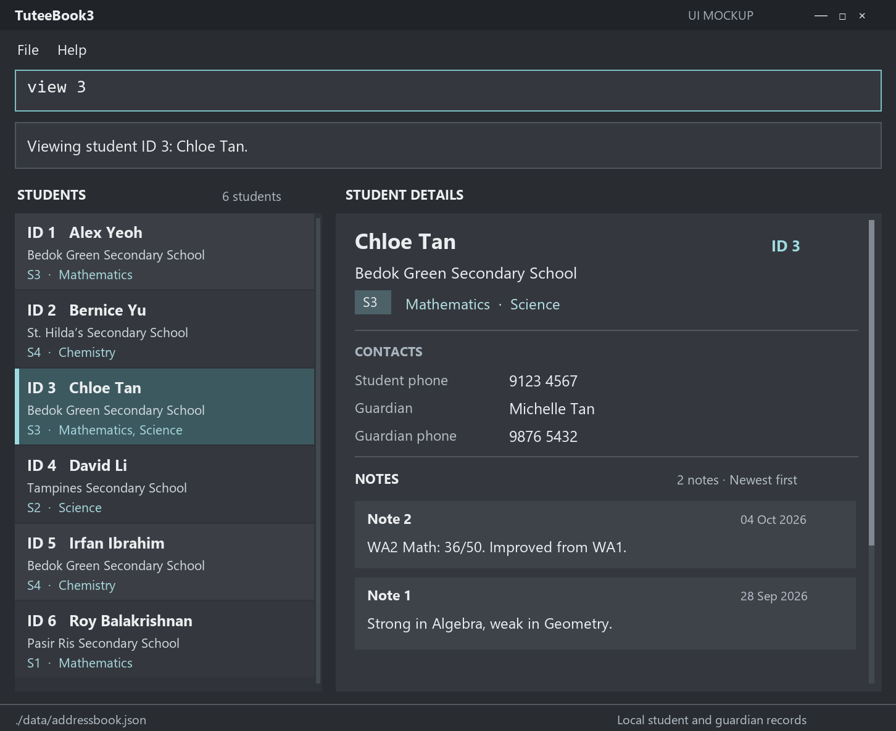

# TuteeBook3

TuteeBook3 is for full-time private tutors in Singapore who teach secondary school students one on one or in small groups. They run the business alone, have lots of students, classes, topics and lessons to keep track of on a weekly basis, almost everyday.

The project is evolving from [AddressBook-Level3](https://se-education.org/addressbook-level3/) as part of the NUS CS2103T team project. Its goal is to keep student and guardian contacts, lesson details, and notes in one locally stored record that a tutor can retrieve quickly.

## Current features

The current version supports the core contact-management workflow:

* Add, edit, and delete contacts.
* Find contacts by name using a case-insensitive search.
* List all saved contacts.
* Store contact data locally in a human-editable JSON file.
* Operate through short typed commands while displaying results in a JavaFX interface.

## Example usage

* A tutor can keep a student's name, phone number, email address, home address, and relevant notes in one contact record.
* A tutor can find a student quickly by name, such as while speaking with the student's guardian.
* A tutor can update a student's details when they change and delete records that are no longer needed.

## Documentation

For User Guide, Developer Guide and About Us, please refer to our [Project Website](https://ay2627s1-cs2103t-t09-1.github.io/tp/).

## Acknowledgements

This project is based on [AddressBook-Level3](https://github.com/se-edu/addressbook-level3) by the [SE-EDU initiative](https://se-education.org/).
