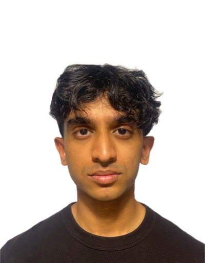
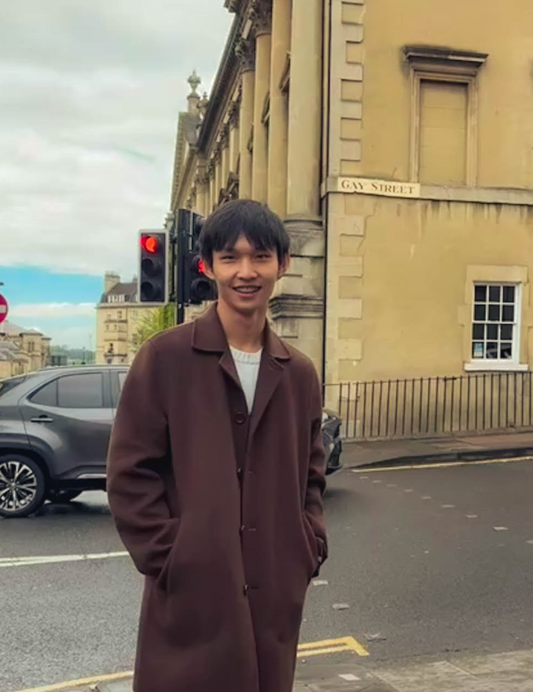
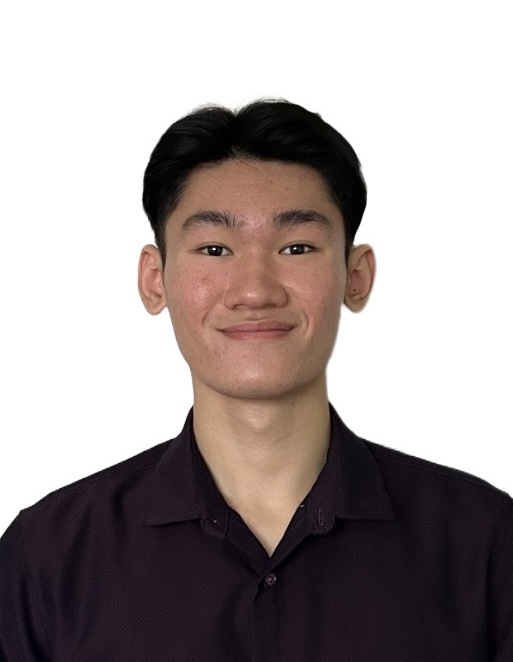
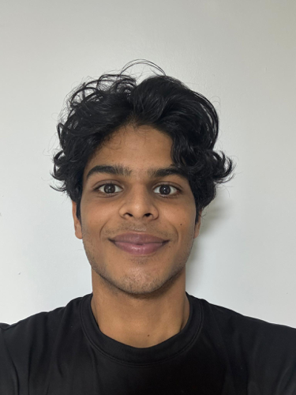
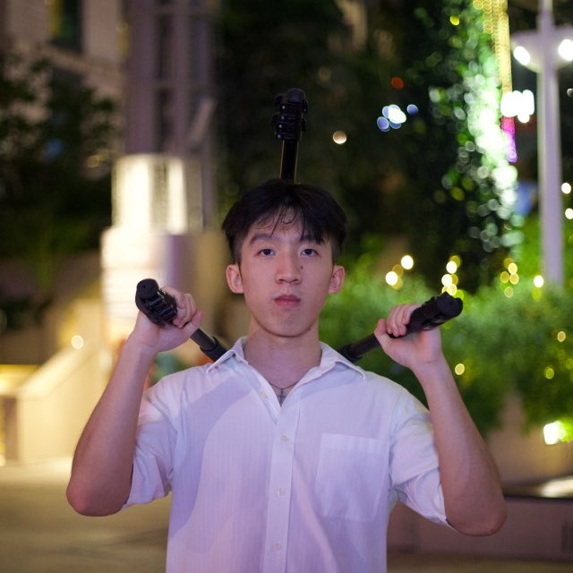

We are a team based in the [School of Computing, National University of Singapore](https://www.comp.nus.edu.sg).

You can reach us at the email `e1525201@u.nus.edu`

## Project team

### Adwaith Anoop

[[github](https://github.com/adwaithanoop)]
[[portfolio](team/adwaithanoop.md)]

* Role: Team Lead
* Responsibilities: Ensure team is on track
* About me: I am a Year 2 Computer Science student. I am interested in AI and take part in Judo and volleyball.

### Zhang Zhuoyang

[[github](http://github.com/Azora04)]
[[portfolio](team/johndoe.md)]

* Role: Developer
* Responsibilities: UI

### Law Jia Kai

[[github](https://github.com/lawjiakai11)] 
[[portfolio](team/johndoe.md)]

* Role: Developer
* Responsibilities: All
* About me: I am a Year 2 Computer Science student who actually loves coding and system design.

### Matthew

[[github](https://github.com/matthewbiju)]
[[portfolio](team/johndoe.md)]

* Role: Developer
* Responsibilities: Development and testing

### Ethan Lai

[[github](https://github.com/ethanlaiii)]
[[portfolio](team/johndoe.md)]

* Role: Developer
* Responsibilities: All
* About me: I am a Year 2 Computer science student minoring in entrepreneurship. I have an interest in cybersecurity.
